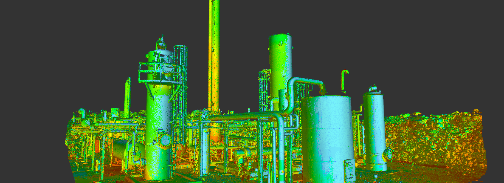

# 测量3D点云数据中的几何体尺寸

本报告记录了本人使用3D数据常用的处理算法，对用3D点云数据代表的几何体进行尺寸测量。

## 引言

### 3D点云的定义

3D点云数据是由大量的点组成的集合，每个点在空间中都有一个三维坐标$(X, Y, Z)$。这些点通常用于描述物体的表面或环境的形状和结构。点云数据广泛应用于计算机视觉、三维建模、地图测绘、建筑设计等领域。

{ width==45% }
