# 测量3D点云数据中的几何体尺寸

本报告记录了本人使用3D数据常用的处理算法，对用3D点云数据代表的几何体进行尺寸测量。

## 1 引言

### 1.1 3D点云

3D点云数据是由大量的点组成的集合，每个点在空间中都有一个三维坐标 $(X, Y, Z)$ 。这些点通常用于描述物体的表面或环境的形状和结构。点云数据广泛应用于计算机视觉、三维建模、地图测绘、建筑设计等领域。

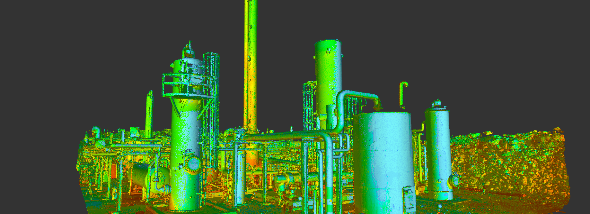

### 1.2 要进行几何尺寸测量的物体

一共有7个点云测量任务，包含9个不同的物体。每个任务都有来自不同视角拍摄的4个点云数据集。原始数据集格式为.npz，为在MATLAB上操作，已将它们全都转换为.mat文件。

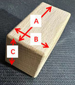{height=174} 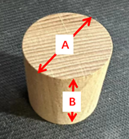{height=174} 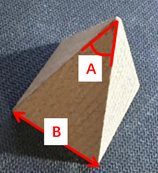{height=174} 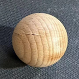{height=174} 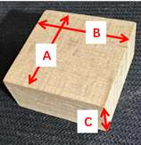{height=174} 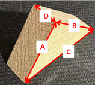{height=174} 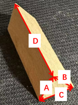{height=174} 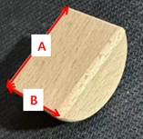{height=174} 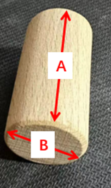{height=174}

在该工作中值得注意的是：

- 第5个任务中要被测量的两个物体叠放在一起。
- 第6个任务中的点云数据集中同时存在两个物体。
- 第7个任务中要被测量的物体是手持物体拍摄的。

如下图：

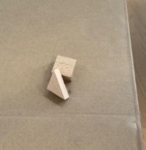{height=174} 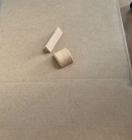{height=174} 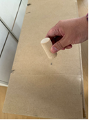{height=174}

## 2 算法介绍

本节将对在该工作中所使用的算法进行介绍。

### 2.1 RANSAC

随机抽样一致（RANdom SAmple Consensus，RANSAC）算法。它采用迭代的方式从一组包含离群的被观测数据中估算出数学模型的参数。 RANSAC是一个非确定性算法，在某种意义上说，它会产生一个在一定概率下合理的结果，而更多次的迭代会使这一概率增加。此RANSAC算法在1981年由Fischler和Bolles首次提出。

RANSAC的基本假设是：

1. “内群”(inlier, 似乎译为内点群更加妥当，即正常数据，正确数据)数据可以通过几组模型的参数来叙述其分布，而“离群”(outlier,似乎译为外点群更加妥当，异常数​​据)数据则是不适合模型化的数据。
2. 数据会受噪声影响，噪声指的是离群，例如从极端的噪声或错误解释有关数据的测量或不正确的假设。
3. RANSAC假定，给定一组（通常很小）的内点群，存在一个程序，这个程序可以估算最佳解释或最适用于这一数据模型的参数。

#### 2.1.1 范例

这里用一个简单的例子来说明，在一组数据点中找到一条最适合的线。假设，此有一组集合包含了内点群以及外点群，其中内点群包含可以被拟合到线段上的点，而外点群则是无法被拟合的点。如果我们用简单的最小二乘法来找此线，我们将无法得到一条适合于内点群的直线，因为最小二乘法会受外点群影响而影响其结果。而用RANSAC，可以只由内点群来计算出模型，而且概率还够高。然而，RANSAC无法保证结果一定最好，所以必须小心选择参数，使其能有足够的概率得到正确的拟合直线。

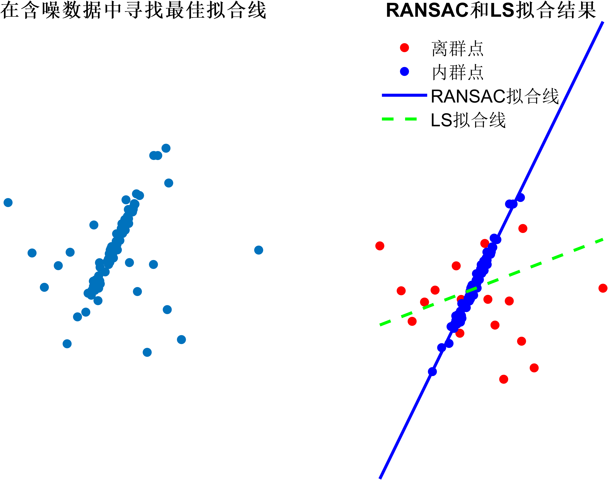

#### 2.1.2 算法概述

算法的具体流程如下：

1. 在数据中随机选择若干个点设定为内点群
2. 计算拟合内点群的模型
3. 把其它刚才没选到的点带入刚才建立的模型中，根据一定的评价标准，计算该点是否属于内点群
4. 记下内点群数量
5. 重复以上步骤
6. 比较哪次计算中内点群数量最多，内点群最多的那次所建的模型就是我们所要求的解

这里有两个问题：

1. 一开始的时候我们要随机选择多少点（$n$）
2. 以及要重复做多少次（$k$）

#### 2.1.3 参数决定

假设每个点是真正内点群的几率是$w$，则：
$$w = 真正内点群的数目 / 数据总数$$
通常我们不知道$w$是多少，$w^𝑛$是所选择的$𝑛$个点都是内点群的几率， $1−w^n$ 是所选择的 $n$ 个点至少有一个不是内点群的几率， $(1-w^{n})^{k}$ 是表示重复 $k$ 次都没有全部的 $n$ 个点都是内点群的几率，假设算法跑 $k$ 次以后成功的几率是 $p$ ，那么：

$$
\begin{array}{l}
1-p=\left(1-w^{n}\right)^{k} \\
p=1-\left(1-w^{n}\right)^{k} \\
k=\frac{\log (1-p)}{\log \left(1-w^{n}\right)}
\end{array}
$$

### 2.2 PCA降维

#### 2.2.1 主要概念

主成分分析（Principal Component Analysis, PCA）是一种广泛使用的降维技术，主要用于简化数据集的维数，同时保留数据中最重要的变化信息。从几何角度上看，PCA是找到一组正交的基向量，使得将数据旋转到新的基向量构成的空间后（这也意味着在不丢失维度信息的前提下，PCA变换是一种保距变换），能集中分布在少数几个基向量（对应着数据方差最大的方向）附近，此时就可以对数据进行降维处理。如下图：

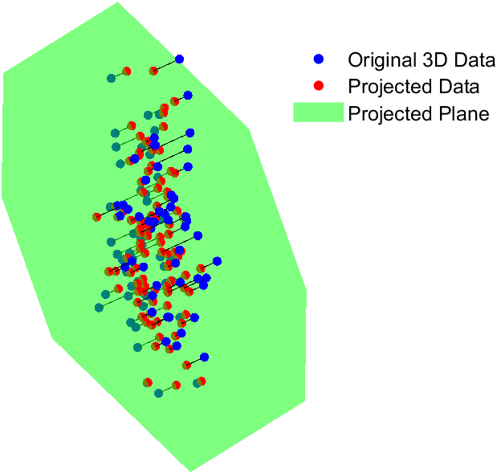

#### 2.2.2 PCA用于3D点云降维

在点云数据处理中，经常会有这样的问题：点云数据原本分布在同一平面上，但受噪声的影响，它们偏离了平面，如何找回点云数据原本所在的斜面，并给出点云数据在原始二维平面上的分布？这样的问题可以通过RANSAC方法去找到一个拟合平面来解决，这里介绍PCA方法在处理该问题上的能力和优势。
可以看到，上述问题实际上包含了两个要求：

1. 去噪。
2. 对数据进行降维。

由于点云数据原本分布在一个平面上，点云数据在该二维平面上位置的变化构成了数据方差的主要来源，又因为PCA能识别出数据的方差最大的方向，而噪声带来的方差比较小，且其方向无规律可言。因此，通过PCA找到数据的前两个主成分对应的特征子空间（数据的前两个变化最大的方向），就可以将该子空间视为点云原本分布的平面。然后，把点云数据投影到该平面上，就可以解决上文中的问题。而这一切，都仅仅是通过几个简单的矩阵运算来完成的。可以看到，这种方法相对于RANSAC方法而言，运算上更为简便和快捷，且能直接得到3D点云的二维分布，即，只有两个维度的点云数据，这极大地方便了后续的处理。

#### 2.2.3 实现

以下给出PCA降维的MATLAB实现代码作为参考：

```MATLAB
function [projected_points] = myPCA(points)
    % 中心化数据
    centered_points = points - mean(points);
    % 计算协方差矩阵
    cov_matrix = cov(centered_points);
    % 求解特征值和特征向量
    [V, D] = eig(cov_matrix);
    % 按特征值大小排序
    [~, idx] = sort(diag(D), 'descend');
    V = V(:, idx);
    % 将数据投影至前两个最大的特征值构成的特征空间
    projected_points = centered_points * V(:, 1:2);
end
```

### 2.3 最小圆覆盖算法

在对点云的圆平面进行检测时，往往会遇到圆平面的边界难以检测的问题，如下图：

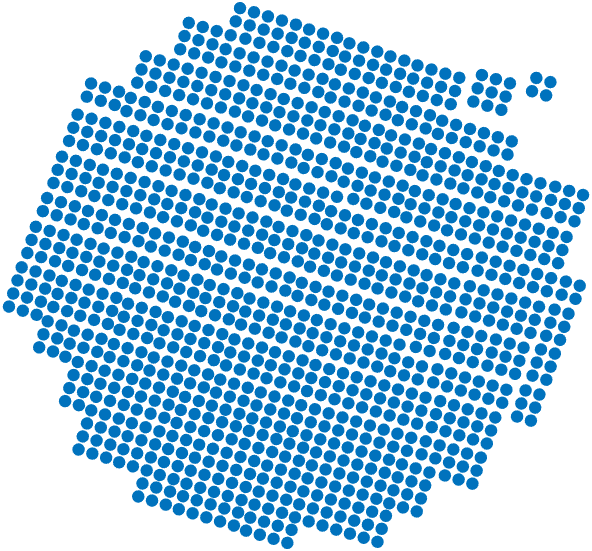

我们显然对这个点云数据集代表的是一个圆平面这个猜测十分有把握，但是由于部分点云没有检测到或被处理掉，导致圆的边界有所缺失，此时，我们很难通过精确的数学方程来解决这个问题。这个问题可以抽象为：给定 $n$ 个点的平面坐标，求一个半径最小的圆，把 $n$ 个点全部包围。常用算法是 [Welzl's algorithm](http://www.sunshine2k.de/coding/java/Welzl/Welzl.html)。这里仅给出该方法的伪代码（如果从递归的角度去思考，把原本的要求得的包含 $|P|$ 个点的最小圆覆盖问题，分解为包含 $|R| <= 3$ 个点的子问题，然后从这些子问题递归回原问题，也许有助于理解该方法的证明。另外值得注意的是，下面的递归算法中， $|R|$ 永远$  <= 3$ ，因为一开始 $|R| == 0$ ，而当$|R|$在递推增加至 $|R| == 3$ 时，算法立即返回 ）：

```Fortran
/*
 * Calculates the sed of a set of Points. Call initially with R = empty set.
 * P is the set of points in the plane. R is the set of points lying on the boundary of the current circle.
 */

function sed(P,R)
{
    if (P is empty or |R| = 3) then
         D := calcDiskDirectly(R)
    else
        choose a p from P randomly;
        D := sed(P - {p}, R);
        if (p lies NOT inside D) then
            D := sed(P - {p}, R u {p});
    return D;
}
```
